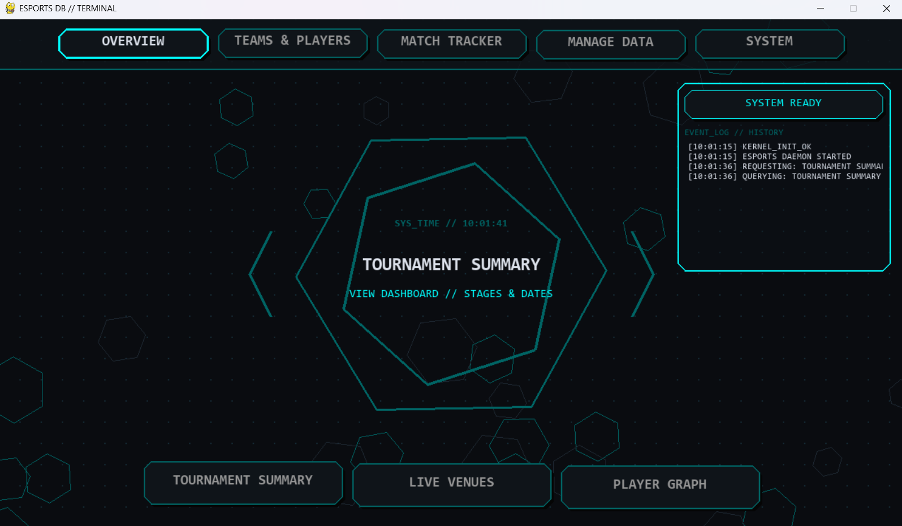
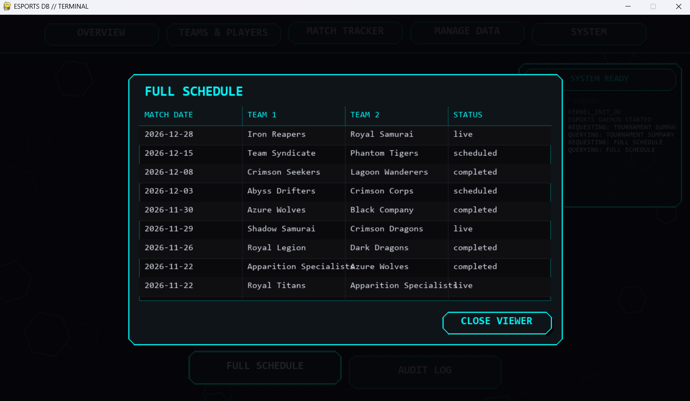
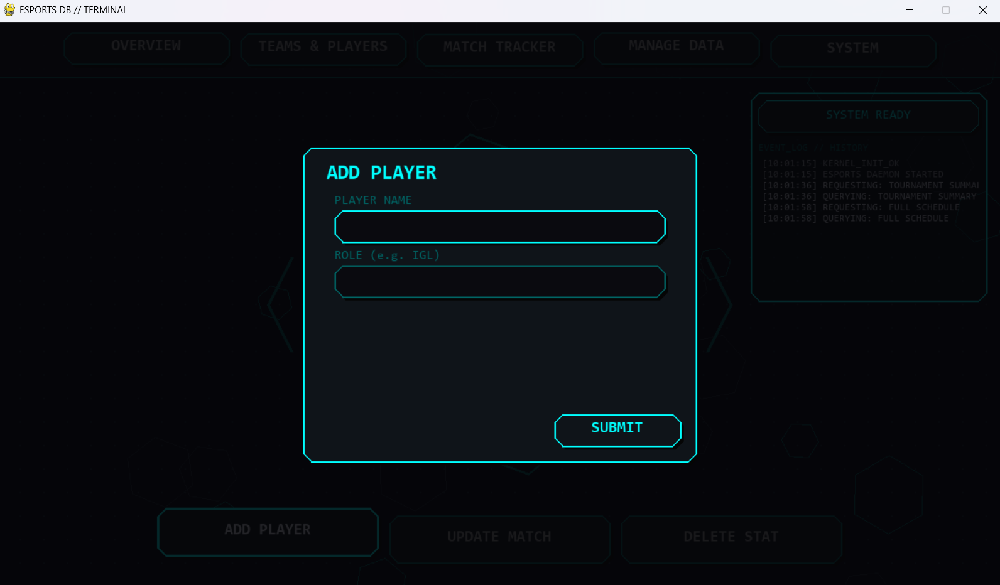

# ESPORTS DB // TERMINAL (HONKAI STAR RAIL THEMED)
### "A high-performance Pygame dashboard for eSports tournament management."


> ⚡ **Context:** This project was developed for a Database Systems (CS160) curriculum to demonstrate the integration of a complex Microsoft SQL Server backend with a hardware-accelerated Python front-end application layer.

---

## 📸 UI

<p align="center">
  
  &nbsp; &nbsp;
  
</p>

<p align="center">
  
</p>

*The UI utilizes asynchronous threading for all database queries via `pyodbc`. This ensures animations, floating UI elements, and interactive screens maintain 60FPS even when fetching complex multi-table SQL joins.*

---

## 🛠️ Installation & Setup

### 1. Database Setup
Before running the UI, the Microsoft SQL Server database must be initialized:
1. Open **SQL Server Management Studio (SSMS)**.
2. Navigate to the `SQL/` directory in this repository.
3. Open and execute `eSports_DB_Creation.sql` to build the schema.
4. Open and execute `eSports_Sample_Data.sql` to populate the tables.

### 2. Python Environment
Clone the repository and install the required dependencies:
```bash
git clone [https://github.com/YOUR_USERNAME/ESPORTS-DB-TERMINAL.git](https://github.com/YOUR_USERNAME/ESPORTS-DB-TERMINAL.git)
cd ESPORTS-DB-TERMINAL
python -m venv venv


# Windows Activation:
venv\Scripts\activate
# Mac/Linux Activation:
source venv/bin/activate

pip install -r requirements.txt
```

### 3. Configuration & Customization
The application is highly customizable. You can modify database connections, themes, and display settings before launching.

**A. Database Connection (`eSports_Engine.py`)**
By default, the application attempts to connect to a local SQL Server named `ASPHYXIATED`. To update this for your machine, open `eSports_Engine.py` and modify the `__init__` method:

```python
self.conn_str = (
    r"Driver={ODBC Driver 17 for SQL Server};"
    r"Server=YOUR_SERVER_NAME_HERE;"
    r"Database=EsportsTournament;"
    r"Trusted_Connection=yes;"
)
```

**B. UI Themes & Colors (`eSports_config.py`)**
The application ships with three default color palettes (Cyan, Orange, Green). You can edit these or add your own custom hex/RGB codes in the `Config` class:

```python
PALETTES: List[Dict[str, Any]] = [
    {"name": "CYAN", "bg": (10, 12, 16), "fill": (15, 20, 25), "accent": (0, 255, 255), "dim": (0, 100, 100), "text": (220, 225, 235), "dots": (20, 40, 50)},
    # Add your own custom theme dictionary here!
]
```

**C. Display Resolution (`eSports_config.py`)**
The terminal runs at `1280x720` by default. You can adjust the `WIDTH`, `HEIGHT`, and `FPS` limits directly at the top of the `Config` class to fit your monitor.

## 🎮 Usage
Launch the terminal dashboard by executing the core script:

```
python eSports_Core.py
```
Use your mouse to navigate tabs and select database query actions.


Use the scroll wheel to navigate populated data tables and the live system log.

You can use Sample Data Generator to fill out your tables.

Press ESC to close any active data viewers or graphs.

## ⚖️ License
Distributed under the MIT License. See LICENSE for more information.
